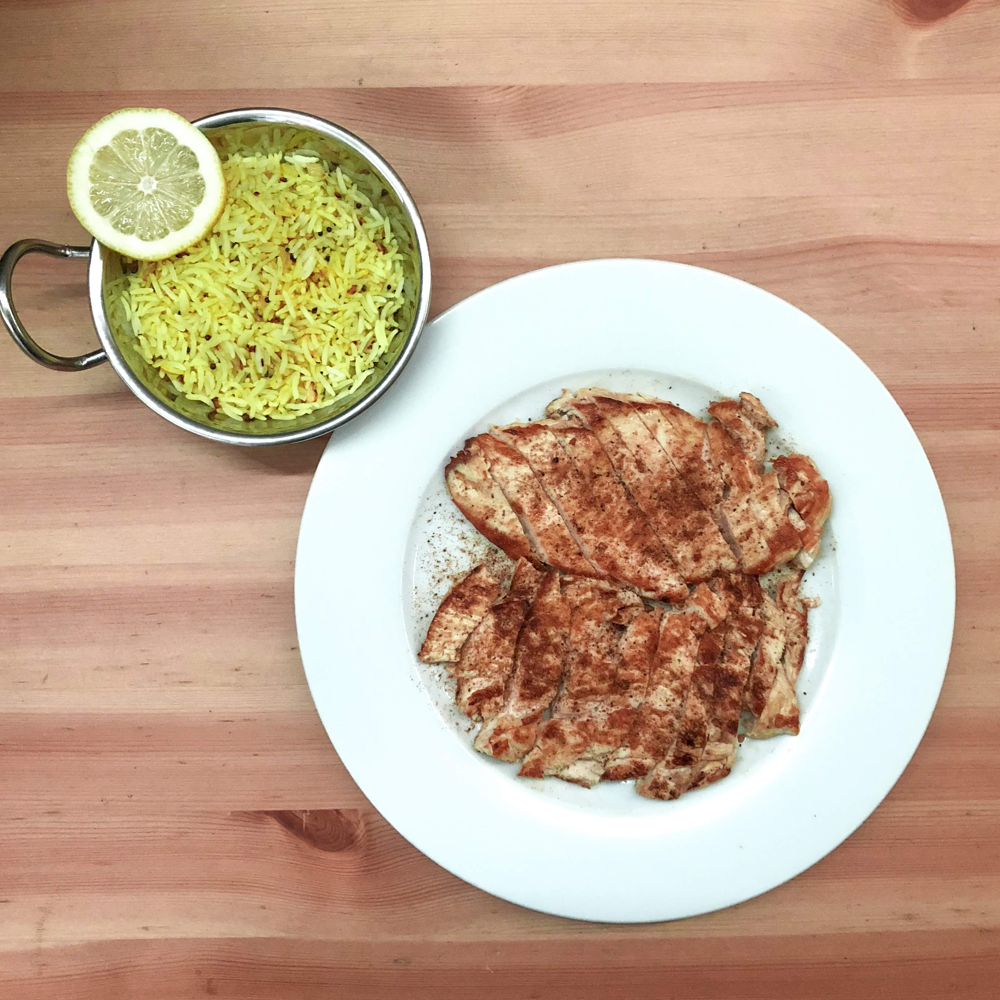

# Lemon Rice

[*YouTube Link Placeholder*]()

### Why this Dish?
Fresh, citrusy way to use up left over rice!

### Tools
1. Large pan
1. Wooden spoon
1. Cutting board
1. Chef's Knife

### Ingredients
1. Cooked rice or Grated cauliflower
1. Half Onion 
1. Garlic (optional)
1. 2 tsp Mustard seeds 
1. 1 Lemon juice
1. Lemon zest
1. 1/2 tsp Turmeric 
1. Salt to taste 

### Preparation
1. Zest a lemon
1. Juice a lemon

### Steps
1. Heat oil with mustard seeds until popped
1. Add onions, sauté for 1-2 minutes
1. Add cooked rice (or grated cauliflower-sauté until cooked)
1. Add lemon juice with zest
1. Add small amount of tumeric
1. Salt to taste 

##### Tags
Tamil, Amma, Vegetarian, Vegan, Carbs