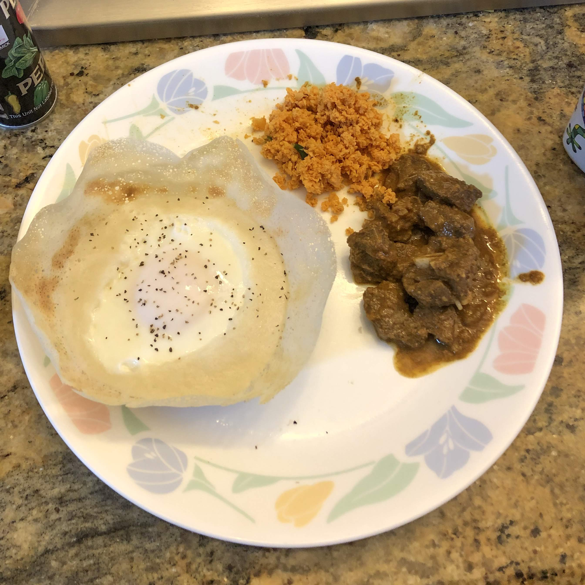

# Appam

[*Amma cooking Appam Video*](https://www.instagram.com/s/aGlnaGxpZ2h0OjE3ODQ2MTYyODI3NTMwOTA1?igshid=2ujrn6q4vvx4&story_media_id=2098361228715235700)

### Why this Dish?
This is the #1 dish I ask for when I go home. Pictured above is what we have for Thanksgiving

### Tools
1. Appam chattee (Hopper pan)
1. Tiny spatula
1. Cooling rack

### Ingredients
1. 200g parts rice flour
1. 100g part AP flour
1. 1 TBSP Sugar 
1. 1 TBSP Salt 
1. 3g Active Dry Yeast
1. 300g parts Water 
1. Coconut milk
2. Baking powder

### Preparation
None

### Steps
1. Mix the above - aim for thick batter
1. Let sit overnight
1. Reconstitute with coconut milk, baking powder, and whip it
1. Cook in the appa chattai until crispy edges
1. Use tiny spatula to move to a cooling rack

##### Tags
Tamil, Thanksgiving, Vegan, Vegetarian, Carbs