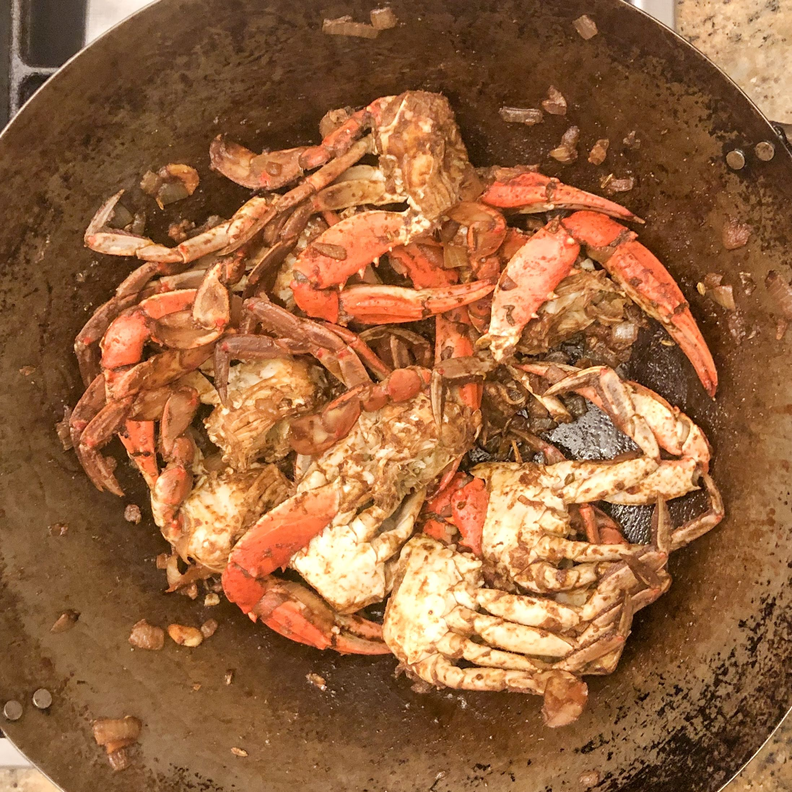

# Crab Pirattal

[*Future YouTube Link*]()

### Why this Dish?
Blue Crab is readily available in Maryland where I grew up and Appa loves making it!

### Tools
1. Wok
1. Wooden spoon
1. Cutting board
1. Sharp Knife

### Ingredients
1. 1 TBSP Gingelly oil
1. 1/4 Onion
1. 4 gloves Garlic
1. 1/3 inch Ginger
1. 2 tsp Fennel seeds
1. 2 Tamilspoons Jaffna Curry powder
1. 10 Curry Leaves
1. 10 blue crabs

### Preparation
1. Dice the onion
1. Chop the garlic and ginger
1. Shred the curry leaves
1. Clean the crab, remove bottom shell, split in half

### Steps
1. Add gingelly oil, onion and sautee til soft - around 10 min
1. Add garlic, ginger, fennel, and curry powder - around 4 min
1. Add the cleaned, split blue crab - cook until red
1. Finish with curry leaves

##### Tags
Appa, Tamil, Protein, Seafood, Pescatarian