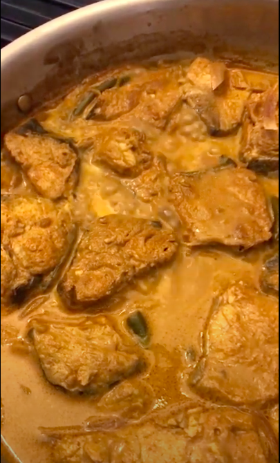

# Fish Kuzhumbu

[*Future YouTube Link*]()

### Why this Dish?
Amma and Appa make it and I love it and it's always slightly different and it doesn't matter

### Tools
1. Cutting board
1. Chef's knife
1. Large pan with deep edges
1. Wooden spoon

### Ingredients
1. 1 can Coconut milk
1. 1/2 Onions - sliced long
1. 4 Green chilies - split
1. 4 cloves Garlic
1. 1 TBSP Venthayam 
1. 1 tsp Coriander powder 
1. 1 tsp cynub oiwder
1. 3 tamilspoons Curry powder
1. 1 tamilspoon Tamarind 
1. 1/4 tsp Tumeric
1. salt
1. 3 lb Kingfish

### Preparation
1. Wash fish with turmeric

### Steps
1. Combine all the ingredients except fish and bring to a boil on high
1. Bring down to medium-high to a simmer
1. Add fish and let cook for ten minutes
1. Flip and cook for another ten minutes
1. Add more coconut milk if you like!

##### Tags
Amma, Appa, Tamil, Pescatarian, Protein