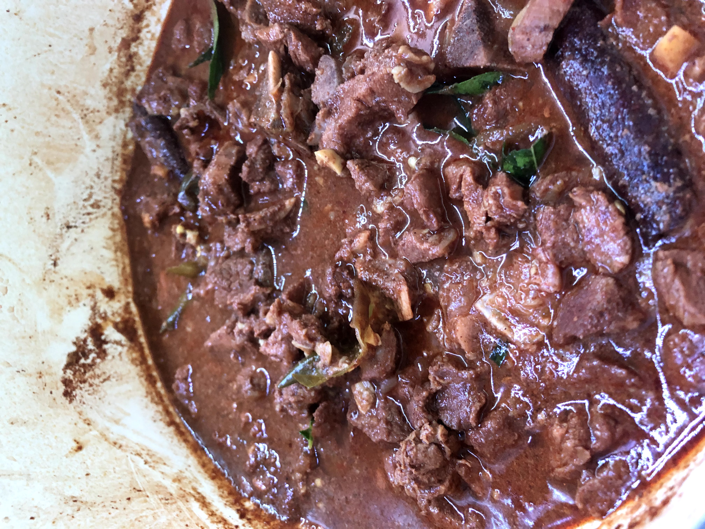

# Goat Curry

[*Watch me cook this on YouTube*](https://www.youtube.com/watch?v=ffsR1kS7oE8)

### Why this Dish?
Goat curry reminds me of Amma's house. We even eat this on Thanksgiving instead of turkey usually with Appam and coconut sambal.

### Tools
1. Large, heavy-bottomed pan
1. Wooden spoon
1. Meat cleaver (big knife)

### Ingredients
1. 2 tsp of oil
1. ½ an onion
1. half a stick of cinnamon
1. 2 tsp of fenugreek
1. 1 lb of goat (or lamb)
1. 1 heaping teaspoon of curry powder
1. 2 gloves garlic minced
1. ½ inch of ginger minced
1. salt to taste
1. long green chilli
1. one black cardamom
1. juice of one lime
1. 5 curry leaves
1. 1 tsp peRanjseera thool
    * roast together [cumin, fennel 2x, coriander, black pepper, raw rice] & ground up

The above is for 1 pound, I usually do 3 pounds (with bone) at a time (whole back goat leg)

### Preparation
1. Dice onion, garlic, ginger, chilies
2. Cube goat small and set aside

### Steps
1. Heat oil on low
1. Add onion, cinnamon, fenugreek and saute until fragrant
1. Turn heat to medium high
1. Add diced meat, curry powder, garlic, ginger, salt, green chillies
1. Saute till caramelized - about 10 minutes
1. Add lots of water (enough to cover completely)
1. Bring heat down to medium low
1. Sautee for an hr (add black cardamom for 20 minutes of that)
1. Sautee top off for 30 minutes, stirring regularly
1. Add curry leaves
1. Add lime juice
1. Add grinder five spice and finish for five minutes

##### Tags
Amma, Tamil, Goat, Lamb, Protein, Curry, Meat