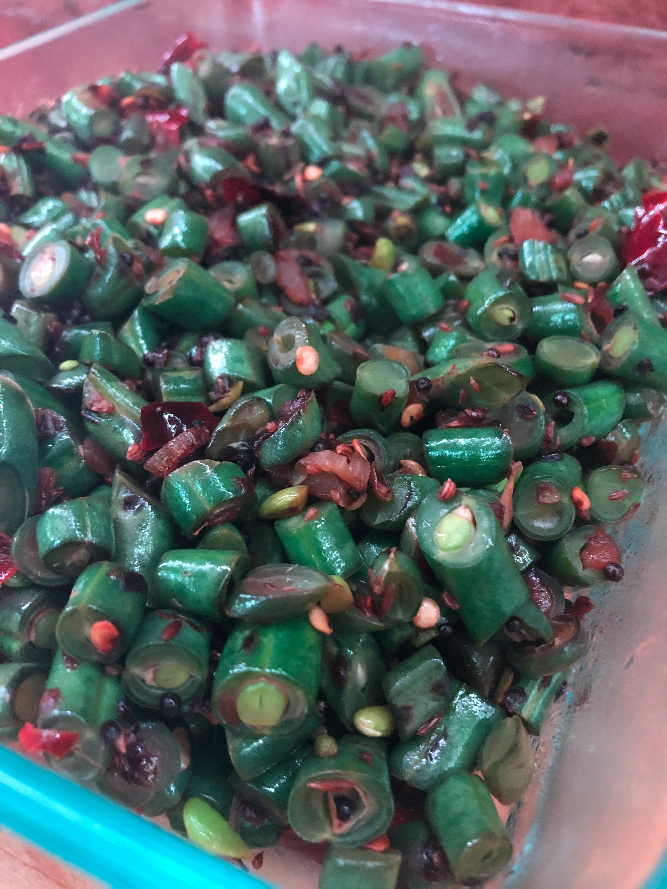

# Dish Title

[*Future YouTube Link*]()

### Why this Dish?
Another staple Amma made growing up. This version is Appachi's twist, with omam (ajwain) seeds. This is super good with rose matta rice :)

### Tools
1. Cutting board
1. Chef's Knife
1. Heavy bottomed pan
1. Wooden spoon
1. Cooking scale

### Ingredients
1. 1 tsp nay (clarified butter)
1. 454g green bean cut short
1. 1 tbsp kadahu (black mustard seeds)
1. 1 tbsp cumin seeds
1. 1 tbsp omam seeds (ajwain seeds)
1. 3 dried red chilies split
1. 1/2 white onion diced
1. salt

### Preparation
1. Dice the onion small
1. Cut the green beans short

### Steps
1. Heat oil on medium high in a heavy bottom pan
1. Add the black mustard seeds until they pop
1. Once almost onion is translucent, add the cumin seeds, omam seeds, and red chilies
1. Once those smell good (about 2 minutes), add the green beans
1. Stir around until beans as soft as you like, about 7 minutes
1. Add the salt

##### Tags
Appachi, Tamil, Vegetarian
