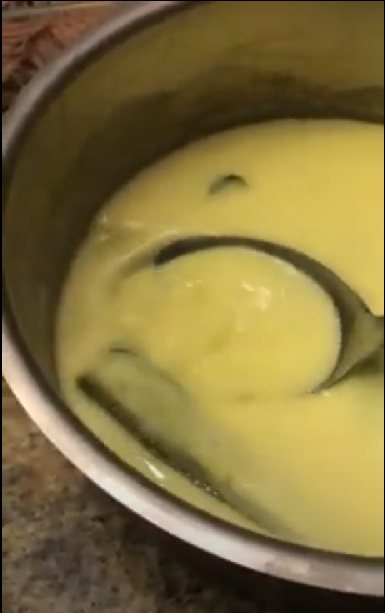

# Idiyappam Sothi

[*Future YouTube Link*]()

### Why this Dish?
Because you can't have idiyappam without sothi. Amma told me that her Appa (my Paatah) ate Idiyappam and Sothi only for dinner every single night.
That's how Amma got so fast at making both items!

### Tools
1. Saucepan
1. Cutting Board
1. Knife

### Ingredients
1. 1 Tbsp Venthayum (Fenugreek Seeds)
1. 1/2 Sliced white onion
1. 3 Sliced green long chillies
1. 1 tsp Tumeric
1. 240 ml Water
1. 120 ml Coconut milk
1. 1/2 of a Lime juiced
1. Salt

### Preparation
1. Slice the onion
1. Slice the chillies
1. Juice the lime

### Steps
1. Add the Venthayum, onion, chillies, tumeric, and water to a the Saucepan
1. Bring to a boil on medium high for 3 minutes
1. Reduce heat to medium low
1. Add the coconut milk and cook for 1 more minute
1. Turn off the heat and the lime and salt for taste

##### Tags
Amma, Vegan, Vegetarian, Tamil