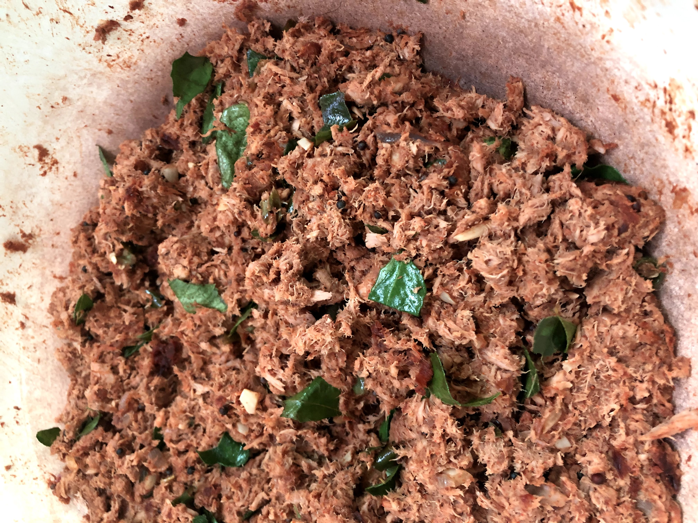

# Meen Varai Tuna Stir-fry

[*Future YouTube Link*]()

### Why this Dish?
Amma and Appa made this for me in sandwich toasters to bring to school when I was a kid. Eventually my friends at school wanted to trade me food for the tuna varai sandwich toaster triangles.

### Tools
1. Cutting board
1. Knife
1. Wok/Large Pan

### Ingredients
1. 2 tbsp vegetable oil
1. 1 tbsp black mustard seeds
1. 1/2 diced red onion
1. 4 cloves garlic chopped
1. 4 small hot green chilies diced
1. 27oz of drained tuna
1. 4 heaping teaspoons of curry powder
    * What kind of curry powder? We usually buy one but it's hard to find so here's Appachi's blend
        * 1 pound dry chillies 
        * 1/2 pound coriander 
        * 1/4 pound fennel 
        * 1/4 pound black pepper  
        * 1/8 pound of fenugreek
        * 1/8 pound of cumin
        * Dash of turmeric 
            * All should be roasted .
            * Could use powdered ingredients as well to get the same results
1. 1 Lime
1. bunch of curry leaves
1. salt

### Preparation
1. Dice the onion
1. Dice the garlic
1. Dice the chillies
1. Drain the tuna
1. Cut the limes

### Steps
1. Add oil to large pan on medium high
1. Add mustard seeds, once they start popping
1. Add the onion, reduce heat to medium, and sautee til 3/4 to done
1. Add the garlic and chillies and go for 2 more
1. Bring heat back up to medium high - add tuna and curry powder 
1. Stir it out til it dries up a bit like the picture ^^, maybe 10 minutes
1. Salt to taste
1. Squeeze the lime and shredd the curry leaves and mix through

##### Tags
Amma, Appa, Appachi, Tamil, protein