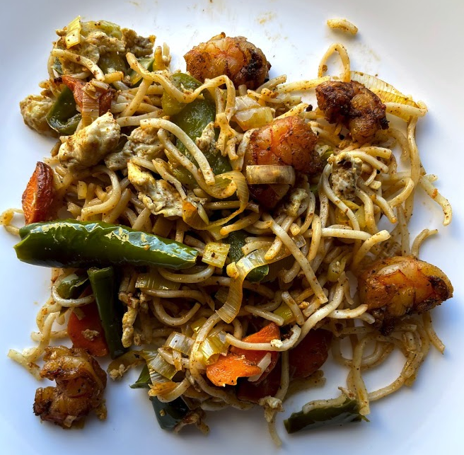

# Dish Title

[*Future YouTube Link*]()

### Why this Dish?
When I went to visit Canada in the time of Corona, my Chiththappa made this to drop off even though we couldn't share a meal together

### Tools
* Cutting board
* Chef's Knife
* Wok

### Ingredients
* 100g Sliced carrot
* 100g Sliced leeks OR cabbage
* 100g Sliced bell peppers
* 100g Chopped green beans
* 900g Shelled and deveined shrimp
* 350g of wheat noodles
* Spray
* 2 tbsp canola oil
* salt
* pepper
* chili powder

### Preparation
1. Slice all the vegetables to bite sized
1. Shell and de-vein the shrimp
1. Cook the noodles 80% of the time on the box

### Steps
1. Add spray to the wok on medium heat
1. Stir fry all vegetables separately to 90% cooked with salt and pepper
    * It's important to do them separately as they have diff cooking times
1. Set cooked vegetables aside
1. Add 1 TBSP oil to wok on high heat
1. Stir fry the shrimp with salt, pepper, and chili powder
1. Set the cooked shrimp aside
1. Add 1 TBSP of oil to the wok on high heat
1. Toss the cooked vegetables, shrimp, and noodles together until it's heated through

##### Tags
Chiththappa, shrimp, noodles, Tamil