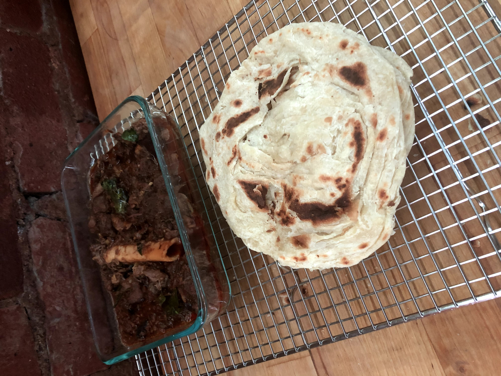

# Parotta

[*Kitchen Guerrilla Highlight*](https://www.instagram.com/s/aGlnaGxpZ2h0OjE3ODcyNDAxOTEwNjY3ODc3?igshid=8g8jbni61adc&story_media_id=2298661892505996627)

### Why this Dish?
I've loved this dish since as long as I can remember. At home, usually we had it packaged from the freezer. When I saw Roshan (Kitchen Guerrilla) made it from scratch on Instagram, I had to try it myself! 

### Tools
1. Massive mixing bowl
1. Towel (dampen and rest)
1. Cooling rack
1. Cast iron skillet

### Ingredients
1. 360g wheat flour ("all purpose" flour)
1. 4g baking powder
1. 6g salt
1. 14g oil
1. 14g ghee
1. 240g warm water
1. Extra oil for soaking
1. Extra Ghee for frying 

### Preparation
1. Weigh out the flour, baking powder, salt, oil, ghee, and water

### Steps
1. Mix dry ingredients (flour, baking powder, and salt) with ghee and oil
1. Add warm water
1. Knead for 10 minutes
1. Create uniform balls (by stretching it on itself to create a clean skin) by weight
1. Submerge balls in oil
1. Flatten on counter until see through 
    * Don't worry if it tears a bit
1. Pick it up from the end, twist it, and coil it onto itself
1. Cover with a damn towel for 1-2 hours
1. Flatten by hand
1. Heat up cast iron pan on medium high 
1. Add ghee to pan
1. Put flattened dough on cast iron and flip every minute or so
1. Stack cooked parotta and cover with foil
1. Smash the stack from the sides for extreme flakiness

##### Tags
Kitchen Guerrilla, Tamil, Carbs, Vegetarian