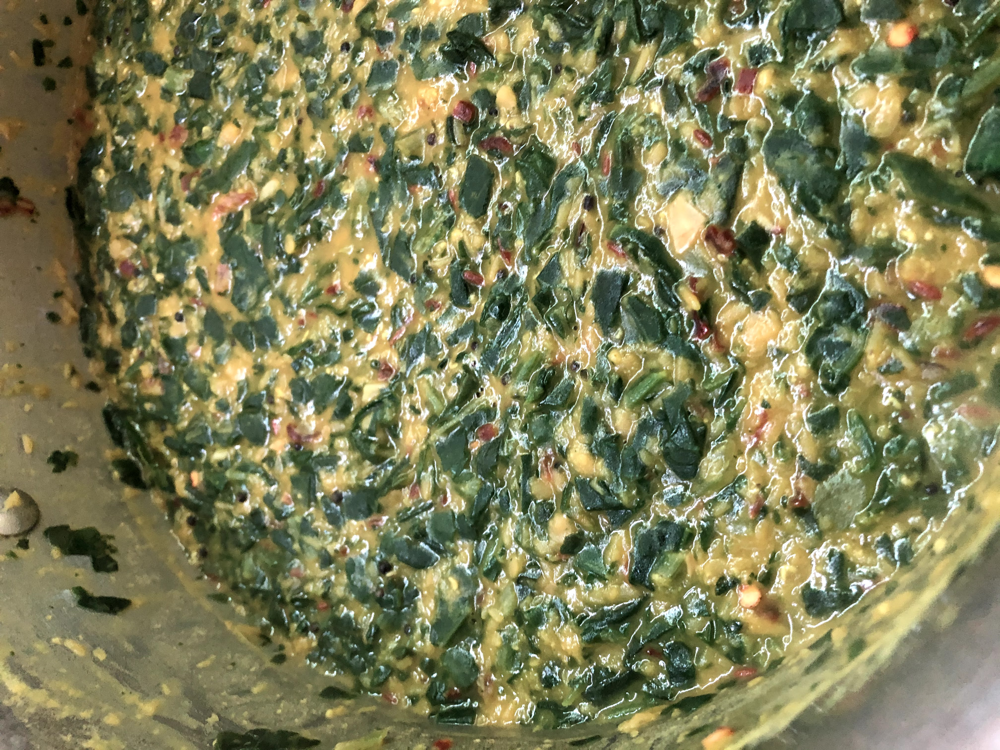

# Paruppu Keerai

[*Future YouTube Link*]()

### Why this Dish?
This was our default dinner growing up - rice and paruppu. I added keerai because it's too easy to sneak in some vegetables.

### Tools
1. Cutting board
1. Chef's Knife
1. Heavy bottomed pot
1. Wooden spoon
1. Cooking scale

### Ingredients
#### Spice mix
1. 2 tbsp ney (clarified butter)
1. 1 tbsp kadahu (black mustard seeds)
1. 1 tbsp jeera (cumin seeds)
1. 3 red dried chillies split
1. 1/2 white onion diced
1. 8 cloves garlic diced
1. 15 curry leaves

#### Paruppu
1. 224g mysoor paruppu (red split lentils)
1. Water (enough to cover lentils by 2 inches)
1. 454g frozen chopped spinach
1. 1 tsp tumeric
1. salt

### Preparation
1. Dice the onion
1. Dice the garlic 

### Steps
1. Heat the pan to medium high
1. Add the mustard seeds til they start popping
1. Reduce heat to medium
1. Add the onion
1. Saute for 10 minutes until almost translucent
1. Add the cumin and chilies and go for 2 more minutes
1. Reduce heat to medium low and Add the garlic for 2 minutes
1. Shred the curry leaves and go for one more minute
1. Remove fried spice mix and let cool
1. Increase heat to medium high, add the red split lentils and water
1. Skim any foam that comes to the top
1. Add the tumeric
1. Stir until fully cooked, about 15 minutes
1. Add the spice mix and salt to taste
1. Add the keerai and put a top on for 8 minutes until fully thawed

##### Tags
Amma, Tamil, Vegetarian
