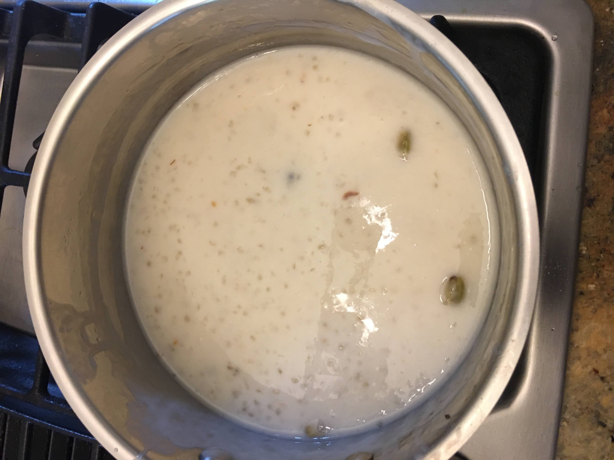

# Payasam

[*Future YouTube Link*]()

### Why this Dish?
Amma used to make this when I was a kid. It was also my first introduction to tapioca. Appa said cassava grows really well where he grew up.

### Tools
1. Bowl to soak tapioca
1. Pot for boiling water
1. Pan for melting butter

### Ingredients
1. 1 cup tapioca pearls
1. 3 cups of water
1. 3-4 cloves
1. 3-4 cardamom 
1. 1/3 cup cashews, chopped
1. 1/3 cup raisins
1. 2-3 tablespoons butter
1. 4 TBSP sugar
1. 8oz condensed milk
1. 1 tsp vanilla
1. Pinch of salt

### Preparation
Depends how you want to order it

### Steps
1. Soak tapioca pearls in water for 10 minutes.
1. Heat a pot of boiling water (separate), once boiling, add tapioca to boiling water (adding the soaked water is fine).
1. Separately, melt butter in pan. Add cashews, cardamom, cloves, raisins. Toast for 3-5 mins
1. Add half can of condensed milk plus 2 tablespoons of white sugar to tapioca pot. 
1. Add cardamom and cloves. 
1. Add cashews and raisins. 
1. Add Pinch of salt.

##### Tags
Amma, Tamil, Desserts, Vegetarian, Appa