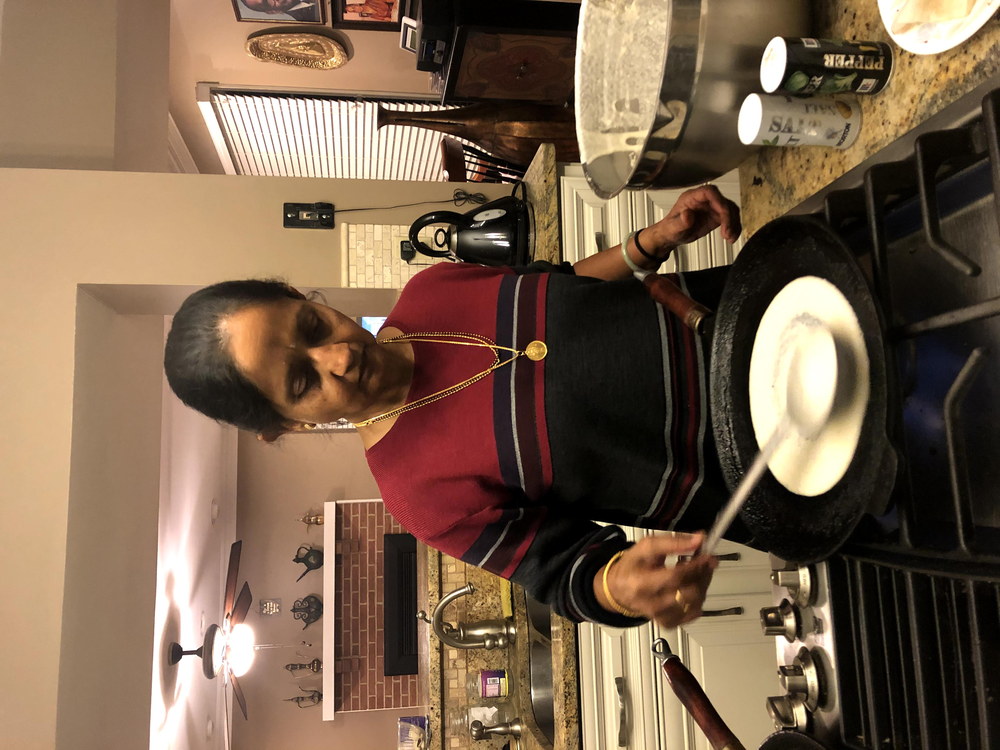

# Rava Thosai

[*Future YouTube Link*]()

### Why this Dish?
It's Amma's specialty and she usually makes it on Fridays

### Tools
1. Cast iron skillet
1. Ladle
1. Huge bowl
1. Blender

### Ingredients
1. 1.5 tsps of venthayam (fenugreek seeds)
1. 1 cup ulunthu (shelled, spit black gram lentil)
1. 0.5 cups rice flour
1. 0.5 cups rava (semolina/sooji course)
1. 1/4 onion
1. Water (covers plus some)
1. Gingelly oil 

### Preparation
1. Dice the onion
1. Add venthayam to ulunthu. Add water to cover plus some. Soak overnight 

### Steps
1. Put soaked ulunthu in blender. Add a little (quarter ish) onion. Blend. 
1. Add 1/2 cup rice flour and 1/2 cup sooji (semolina) and mix
1. Leave for overnight to ferment
1. Stir, add salt, make sure it tastes a bit sour
1. Put the gingelly oil on the cast iron skillet
1. Spread the batter in ever increasing concentric circles
    * NOTE: the first thosai always sticks - don't stress it too hard
1. Flip when you see bubbles

##### Tags
Amma, Tamil, Vegan, Vegetarian, Sourdough