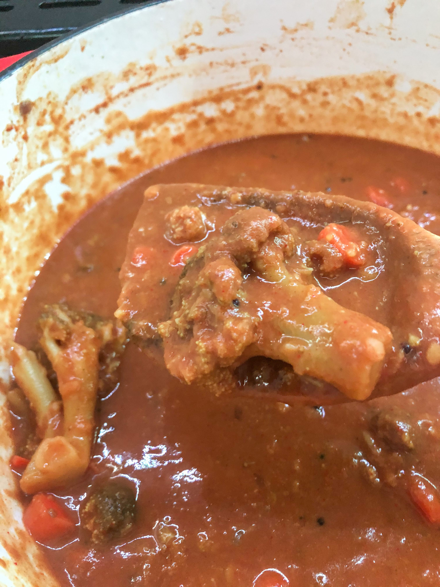

# Sambar

[*Future YouTube Link*]()

### Why this Dish?
We always joke this is Amma's favorite dish. It's a great way to use up any leftover vegetables you have and goes well with rice, thosai, upma, among other carbs!

### Tools
1. Cutting board
1. Chef's Knife
1. Pressure cooker for thuvarum (toor daal/split pigeon pea)
1. Heavy bottomed pot for vegetables
1. Wooden spoon

### Ingredients
1. 2 TBSP oil
1. 1/2 red onion diced
1. 1 TBSP black mustard seeds
1. 200g thuvaram (toor daal/split pigeon pea)
1. 454g veg 
1. 2 tsp tumeric
1. 3 Tamilspoons sambar podi
1. 2 Tamilspoons plain red extra hot chili powder
1. 1 Tamilspoon tamarind concentrate
1. salt

### Preparation
1. Dice the red onion
1. Make sure your veg is bite sized otherwise you are gonna get sambar all over your face while you eat

### Steps
1. Add the thuvaram to the pressure cooker and cover with 2 inches of water
1. Close the lid and put heat on high
1. Once the valve has closed, reduce heat to medium and set a timer for 6 minutes
1. Once the timer goes off, remove the pressure cooker from the heat and put on a heatproof surface for 15 minutes and the valve to open
1. Add oil to heavy bottomed pot on medium high heat
1. Add the mustard seeds 
1. Once the mustard seeds pop, add the onion and saute for 10 minutes on medium heat until soft
1. Add the veg and saute for 5 minutes (not fully cooked, just to get some char)
1. Open the pressure cooker and pour the cooked thuvarum into the heavy bottomed pot
1. Add the tumeric and sambar podi and stir
1. Add the chili powder
1. Add the tamarind concentrate and bring to a boil to make sure it all dissolved
1. Let this all cook together for 20 minutes
1. Add salt to taste

##### Tags
Tamil, Amma, Vegetarian, Vegan, Protein