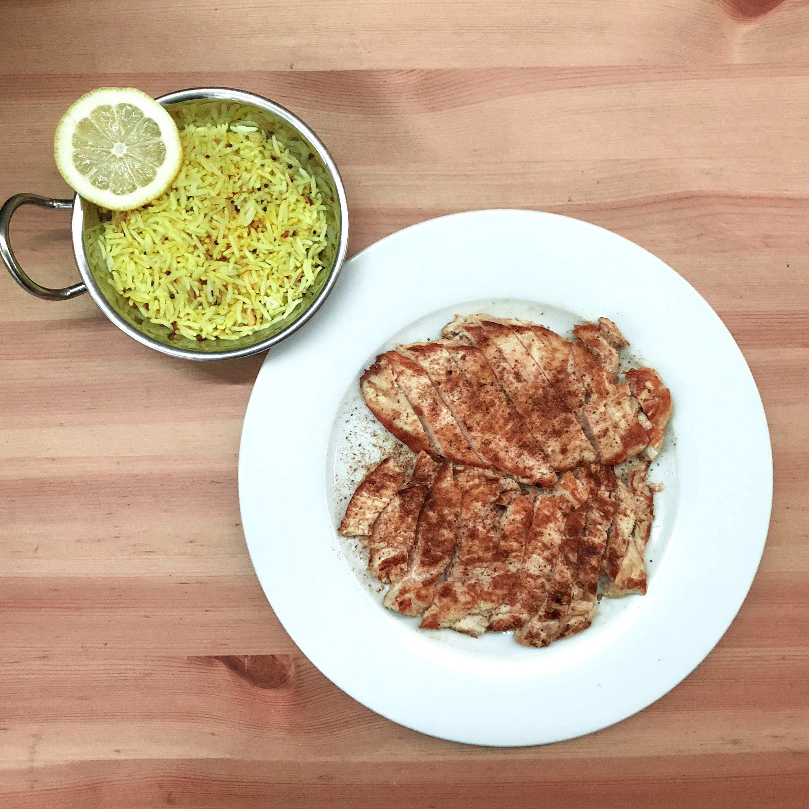

# Ulunthu Vadai

[*YouTube Link Placeholder*]()

### Why this Dish?
The light, crispy, fermented, and spiced batter right out of the fryer with coconut sambol is sensory surprise every time. 

### Tools
1. Deep fryer / Heavy bottomed bot
1. Cooling rack 
1. Bowl to soak ulunthu
1. Cutting Board
1. Sharp Knife
1. Food processor

### Ingredients
1. Ulunthu - 200g
1. Water to cover
1. 1/2 Onion
1. 2 Long Green Chili
1. 1/3 inch Ginger
1. Fennel seeds 1 TBSP
1. 1/4 tsp baking powder
    * baking powder gives it the light internal texture
1. Oil for frying

### Preparation
1. Soak ulunthu for 2-4 hours
1. Chop onion, chilies, and ginger

### Steps
1. Grind ulunthu to smooth paste in food processor
1. Add chopped onion, green chilies, fennel seeds, chopped ginger
1. Add salt, 1/4 tsp baking powder and mix
1. Heat oil to 350F - fry til golden brown (about 4 minutes)

##### Tags
Tamil, Amma, Vegetarian, Vegan, Short eats 