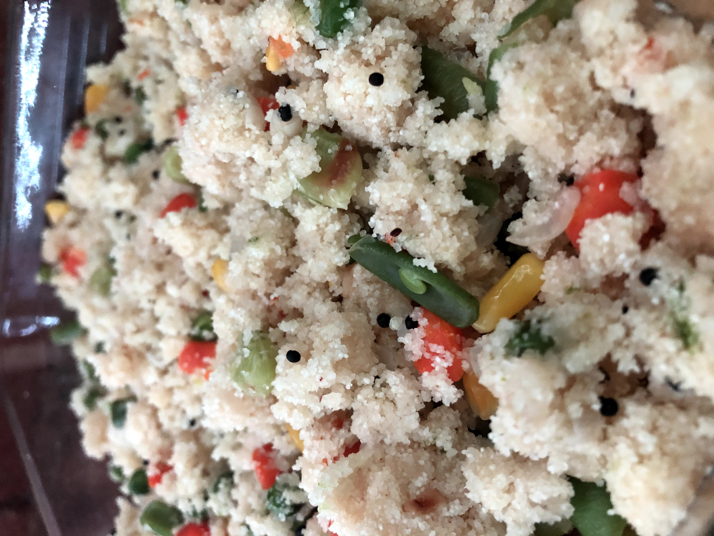

# Upma

[*Future YouTube Link*]()

### Why this Dish?
Amma used to make this with pan-fried curried potatoes and curry omelette!

### Tools
1. Heavy bottomed pot
1. Wooden spoon
1. Cutting board
1. Chef's Knife

### Ingredients
1. 2 TBSP oil
1. 350g sooji
1. 1/2 an onion
1. TBSP of black mustard seeds
1. 525g water
1. 250g mixed veg
1. 1/2 inch ginger
1. Salt to taste

### Preparation
1. Dice onion
1. Roast the rava on medium/medium high for ~10 minutes until hot to the touch and set aside
1. Shred ginger

### Steps
1. Add oil on medium high
1. Add black mustard seeds until they pop
1. Add onion, adjust heat to medium until transcluent
1. Add mixed veg and ginger; saute for 5 minutes
1. Add the water and bring to a boil
1. Add salt to the water
1. Add roasted sooji and mix with wooden spoon
1. Stir until slighly crumbly

##### Tags
Amma, Tamil, Vegetarian, Vegan, Carbs