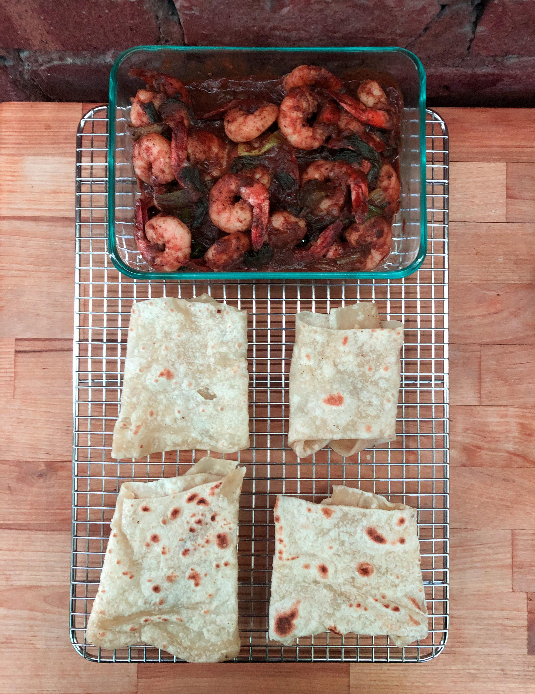

# Veechu Roti

[*Optional YouTube Link*]()

### Why this Dish?
The first time I had this was in Canada with my Chithappa when I was 5 or 6 years old. The first time homemade was by Appachi! She made it when we visited her in Sydney. This recipe is by Kitchen Guerrilla, though.

### Tools
1. Massive mixing bowl
1. Towel (dampen and rest)
1. Cooling rack
1. Cast iron skillet

### Ingredients
1. 360g wheat flour ("all purpose" flour)
1. 4g baking powder
1. 6g salt
1. 14g oil
1. 14g coconut oil
1. 240g warm water
1. Extra oil for soaking

### Preparation
1. Weigh out the flour, baking powder, salt, oil, coconut, and water

### Steps
1. Mix dry ingredients (flour, baking powder, and salt) with coconut and oil
1. Add warm water
1. Knead for 10 minutes
    * Pull it back to you and push down with kunckle
    * Need to be sticky but not breaking apart
1. Create uniform balls (by stretching it on itself to create a clean skin) by weight
1. Submerge balls in oil for 1-2 hours
1. Remove dough from oil and flatten on counter until see through 
    * Don't worry if it tears a bit
1. Start cast iron skillet on medium heat, lower to medium low
1. Flip very often - you want it to stay pliant, not get crispy
1. Remove before it starts cracking

##### Tags
Kitchen Guerrilla, Tamil, Carbs, Vegetarian