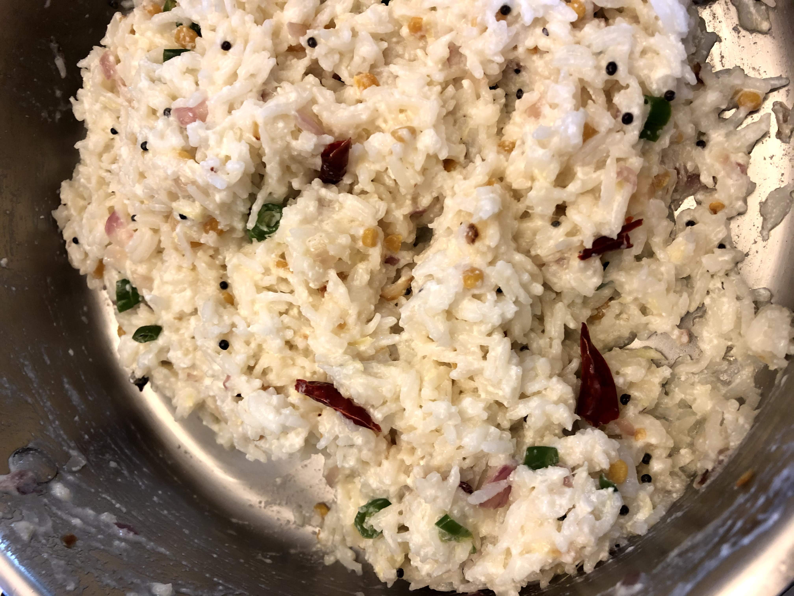

# Yogurt Rice

[*Future YouTube Link*]()

### Why this Dish?
It reminds me of what I used to eat while watching The Price is Right during the summer as a child

### Tools
1. Big pot
1. Wooden spoon

### Ingredients
1. 1 tbsp Oil
1. 2 tsp Mustard seeds
1. 1/4 Onion
1. 1 Green chili 
1. 1 Dry chili 
1. Kadalai (chana daal)
1. 1 cup cooked rice
1. Half cup of yogurt

### Preparation
1. Dice onion
1. Grate ginger

### Steps
1. Add oil to pan on medium heat
1. Add mustard seeds until they  pop
1. Add onion, green chili, dry chili, and kadalai
1. Sauté top on
1. Ginger after
1. Lower heat to low
1. Add yogurt
1. Add cooked rice
1. Add salt 

##### Tags
Tamil, Amma, Vegetarian, Carbs